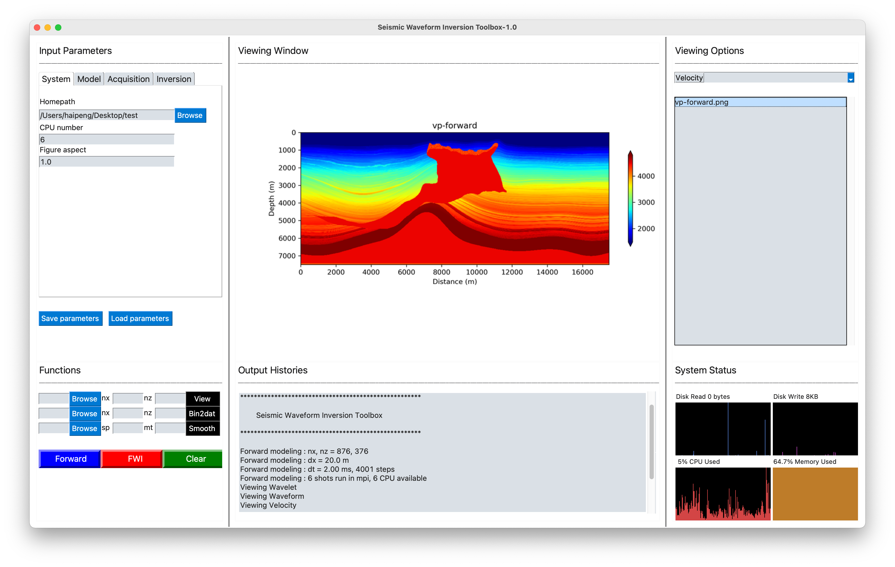
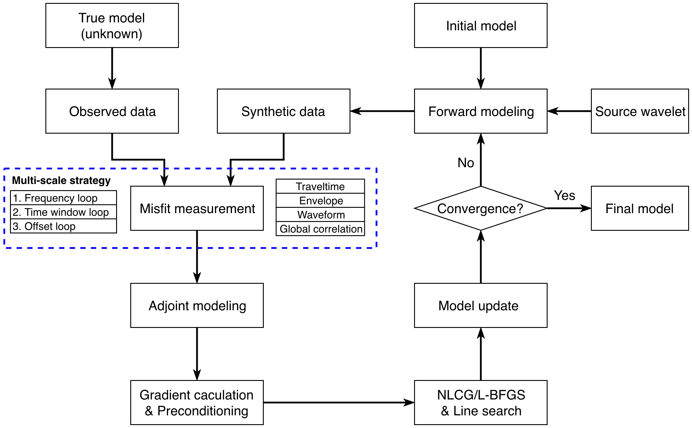
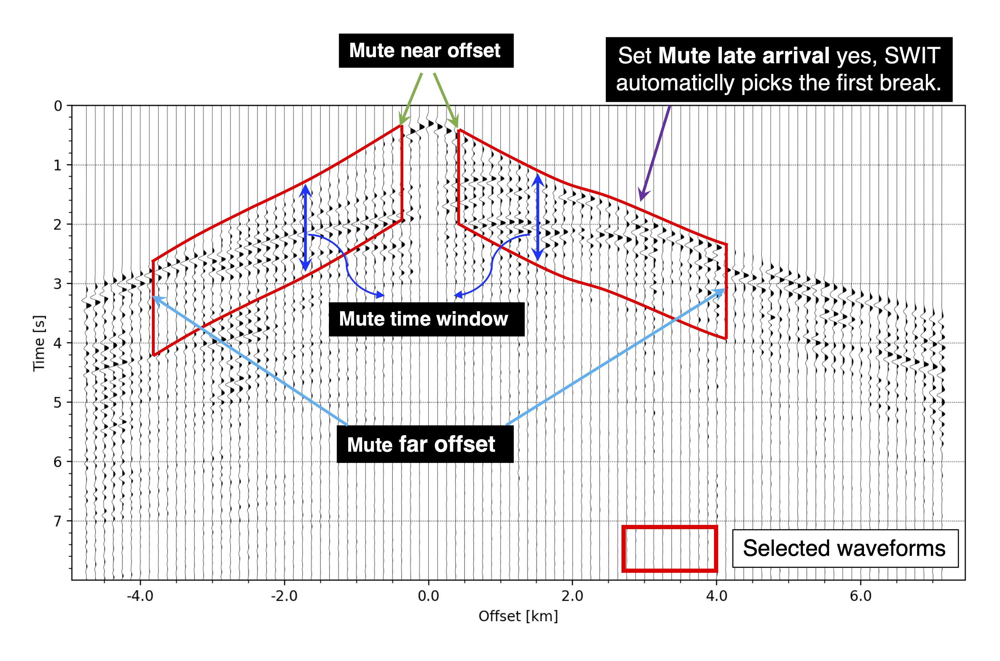

# **S**eismic **W**aveform **I**nversion **T**oolbox   (SWIT-1.0)

By Haipeng Li @ USTC

Contact: haipengl@mail.ustc.edu.cn

### First look at SWIT



### Contents of SWIT


### Workflow of SWIT 



### Waveform Selection in FWI




## SWIT Installation 

#### Step 1: Install  gfortran

```bash
# Install gcc and gfortran
sudo apt-get install build-essential
sudo apt install gfortran
```

#### Step 2 : Install OpenMPI

```bash
# Download the latest OpenMPI package, or go to  http://www.open-mpi.org/software/ompi to download the desired version
wget https://download.open-mpi.org/release/open-mpi/v4.1/openmpi-4.1.1.tar.gz 
tar xvfz openmpi-4.1.1.tar.gz
cd openmpi-4.1.1

# Configure the installation files and install OpenMPI (this would take quite a while)
./configure --prefix=/usr/local/openmpi CC=gcc FC=gfortran
make    # make -j8  # use 8 cores to speed up the make process
sudo make install

# Add env path at your ~/.bashrc
vim ~/.bashrc
export PATH=/usr/local/openmpi/bin:$PATH
source ~/.bashrc

# Check OpenMPI is successfully installed
which mpirun
```

#### Step 3 : Install Anaconda Environment (Otherwise, just install Python dependencies as you like)

```bash
# Anaconda is recommended. For installing Anaconda, please refer to https://docs.anaconda.com/anaconda/install/linux/
# 1. download package from: https://www.anaconda.com/products/individual/download-success
# 2. bash your_downloaded_Anaconda_package

# Create the conda environment for SWIT if you use Anaconda
conda create --name SWIT python=3.7.5
conda activate SWIT

# Install dependencies using USTC mirrors (whether use Anaconda or not)
pip install numpy obspy scipy matplotlib multiprocess PySimpleGUI psutil Pillow -i https://pypi.mirrors.ustc.edu.cn/simple/
```

#### Step 4 : Install & Run SWIT  

```bash
# Complie the fd2dmpi forward solver with the default fortran compiler (mpif90).
# If you want to use other fortran compiler, you can edit the Makefile.config file (line 18) under ~/SWIT-1.0/fd2dmpi/.
cd /your/own/path/to/SWIT-1.0/fd2dmpi/
rm *.mod
make clean
make

# Add fd2dmpi and Python toolbox to the env path at your ~/.bashrc 
vim ~/.bashrc 
export PATH=/your/own/path/to/SWIT-1.0/bin:$PATH
export PYTHONPATH=/your/own/path/to/SWIT-1.0/toolbox
source ~/.bashrc

# Option 1. Run SWIT via GUI
cd /your/own/path/to/SWIT-1.0/toolbox/
python runswit_Linux.py    # or python runswit_MacOS.py 

# Option 2. Run SWIT via the Python script
cd /your/own/path/to/SWIT-1.0/example/some_case/
./run_workflow     # You need to modify all the paths in the Python script before running

# Notice:
# If you use the Intel Compiler, you need to make the following change in forward and adjoint functions in toolbox/solver.py: 
# Before:     
#	   solver_cmd = 'mpirun -np %d  fd2dmpi par=%s' % (mpiproc, parfile)
# After:
#    solver_cmd = 'mpiexec -np %d  fd2dmpi par=%s' % (mpiproc, parfile)
```

#### Systems  

```bash
SWIT-1.0 has been tested on Ubuntu 16.04, 18.04, 20.04, Centos 7.
It seems that SWIT-1.0 cannot run on MacOS properly due to the problem with the Python multiprocess module. 
This issue will be fixed in the near future.
```

## FWI examples (keep updating)

| No.  | Acquisition |   Model    |         Misfit         |       Features        | Optimization |     Size      |
| :--: | :---------: | :--------: | :--------------------: | :-------------------: | :----------: | :-----------: |
|  1   |    Land     |  Marmousi  |        Waveform        |           -           |     NLCG     | 481x121, 25 m |
|  2   |    Land     | Overthrust |        Waveform        |           -           |     NLCG     | 401x101, 25 m |
|  3   |   Marine    |  Marmousi  |        Waveform        |           -           |     NLCG     | 481x141, 25 m |
|  4   |   Marine    | Overthrust |        Waveform        |           -           |     NLCG     | 401x121, 25 m |
|  5   |    Land     |  Marmousi  | Traveltime &  Waveform |   1D initial model    |     NLCG     | 401x121, 25 m |
|  6   |    Land     | Overthrust |        Waveform        | Multi-scale Inversion |     NLCG     | 401x101, 25 m |

## Citations :   

```
If you find SWIT is useful, please cite the following work:

1. Li, H., Li, J., Liu, B., Huang, X. (2021). Application of full-waveform tomography on deep seismic profiling dataset for tectonic fault characterization. International Meeting for Applied Geoscience & Energy.

2. Schuster, G. T. (2017). Seismic inversion. Society of Exploration Geophysicists. https://library.seg.org/doi/book/10.1190/1.9781560803423
```
## Few more words:
1. Simplicity is the Greatest Virtue Ever.

2. The Seismic WIT always lies within.
