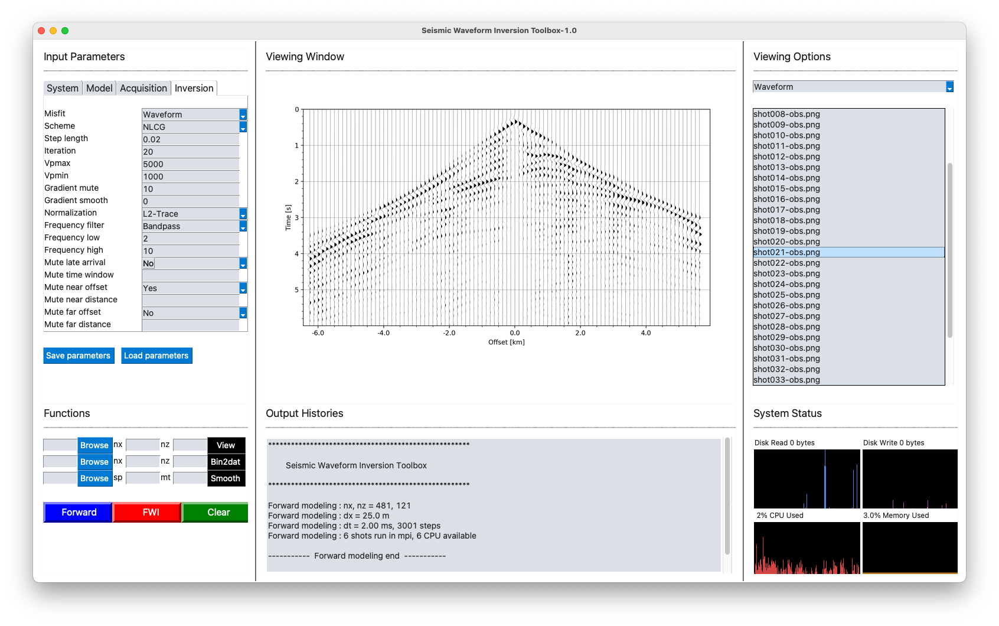
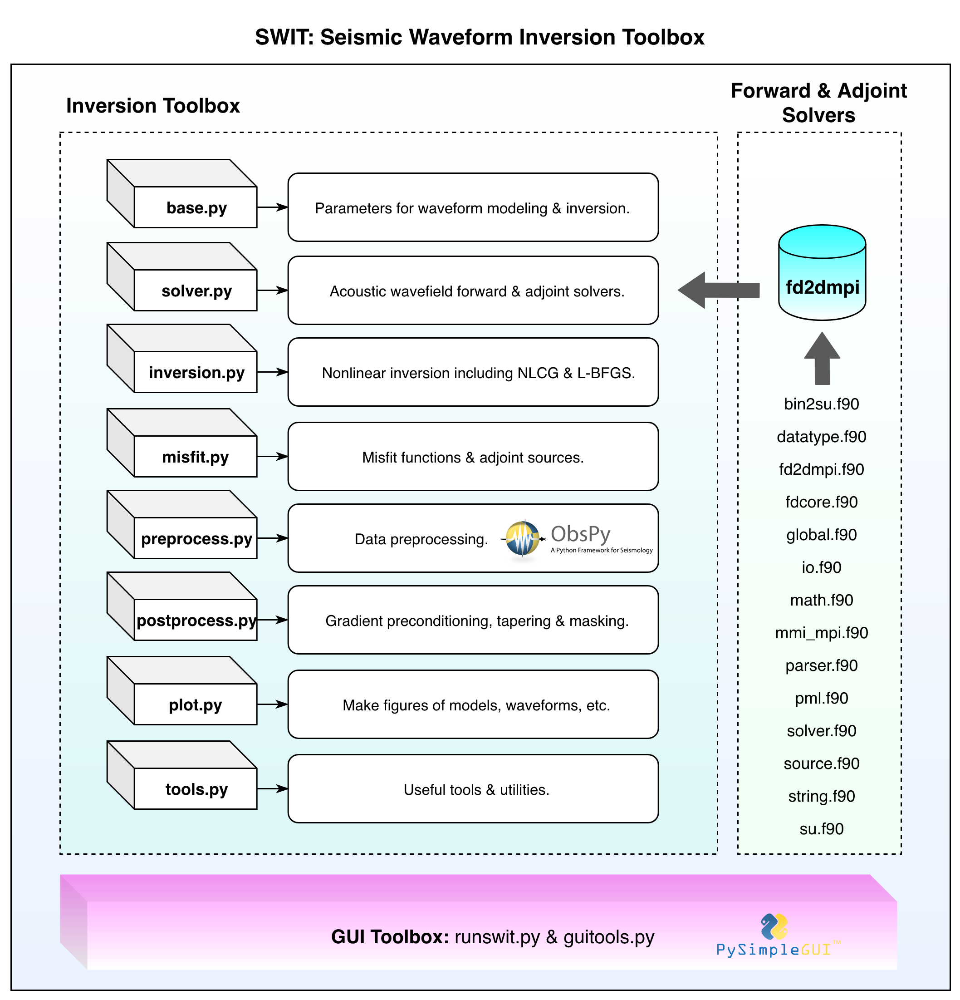
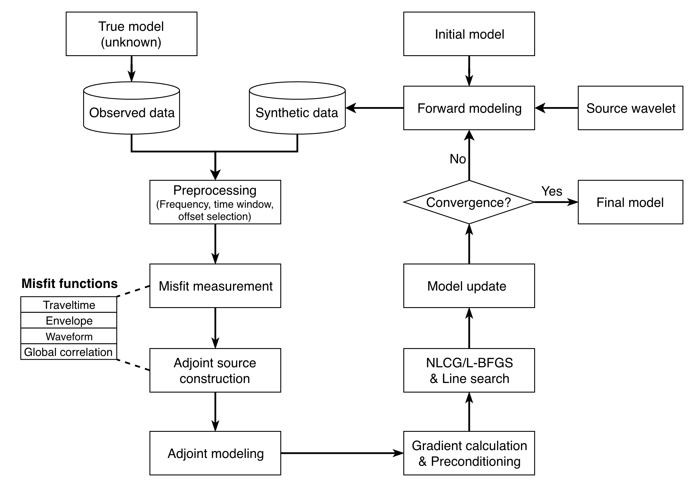
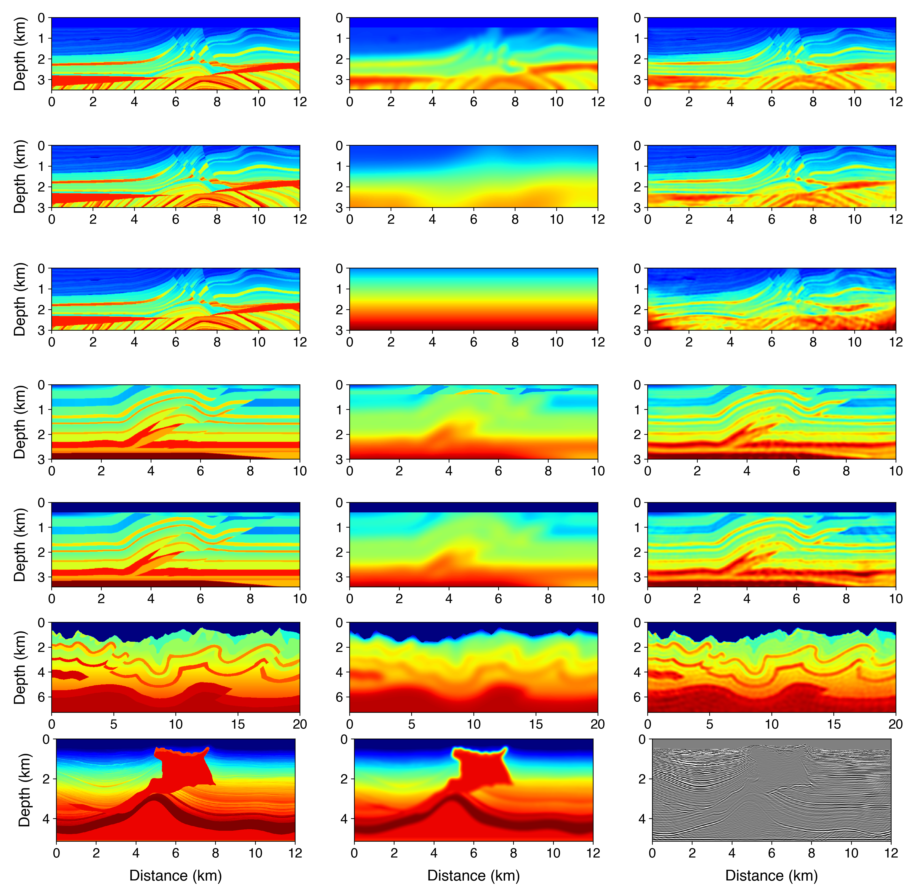
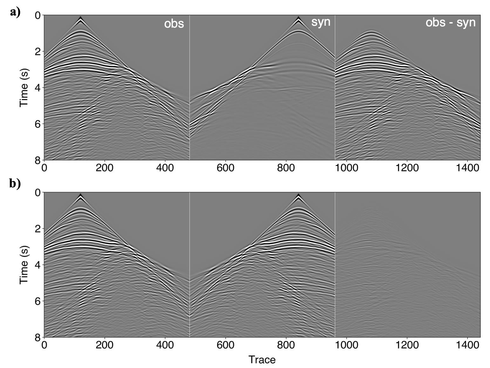

# SWIT-1.0


**S**eismic **W**aveform **I**nversion **T**oolbox-1.0 (**SWIT-1.0**) is a 2-D acoustic Full-waveform Inversion (FWI) package implemented in Fortran and Python. It includes efficient and accurate forward and adjoint wavefield modeling solvers. The simulated waveforms and the calculated gradients have been well verified. Two different nonlinear inversion optimizations schemes, i.e., the nonlinear conjugate gradient (NLCG) method and the quasi-Newton method (L-BFGS) are implemented in accompany with an efficient line search strategy. Various misfit functions, including the L-2 waveform (Tarantola, 1984), the cross-correlation  (Luo & Schuster, 1991), and the normalized global-correlation coefficient (Choi & Alkhalifah, 2012) are provided. More misfit functions can be easily implemented by users themselves. To facilitate the usage of this FWI package, a dedicated Graphic User Interface (GUI) is provided with numerous pre-defined parameters that may be suitable for many inversion scenarios. One may also run an FWI project through Python scripts provided in the [examples](https://github.com/Haipeng-ustc/SWIT-1.0/tree/main/examples). Please also find our tutorial on FWI here:  [Video](http://seismo.training.ustc.edu.cn/index.php/video), [Slides-Part1](http://seismo.training.ustc.edu.cn/public/%E6%9D%8E%E4%BF%8A%E4%BC%A6%E8%80%81%E5%B8%88%E8%AF%BE%E4%BB%B6.pdf), [Slides-Part2](http://seismo.training.ustc.edu.cn/public/SWIT%E7%A8%8B%E5%BA%8F%E4%BB%8B%E7%BB%8D.pdf).




By Haipeng Li @ University of Science and Technology of China,  haipengl@mail.ustc.edu.cn

Since Sep., 2022, I have moved to Stanford University, haipeng@standford.edu


## Installation 

### Step 1:  gfortran & OpenMPI

```bash
sudo apt-get install build-essential
sudo apt install gfortran

# Download the OpenMPI package, 
# or go to: http://www.open-mpi.org/software/ompi to download the desired version
wget https://download.open-mpi.org/release/open-mpi/v4.1/openmpi-4.1.1.tar.gz 
tar xvfz openmpi-4.1.1.tar.gz
cd openmpi-4.1.1

# Configure & install OpenMPI (this would take quite a while)
# If no sudo permision granted, install OpenMPI in your personal folder, i.e.
# /home/user-name/softare/openmpi/
./configure --prefix=/usr/local/openmpi CC=gcc FC=gfortran
make
# if you install on: /usr/local/openmpi 
sudo make install
# if you install on your personal folder, no sudo required
make install

# Add path to ~/.bashrc
# If you use a personal path, change to your path
echo export PATH=/usr/local/openmpi/bin:$PATH >> ~/.bashrc
source ~/.bashrc

# Check
which mpirun
```

### Step 2 : Python & Compile fd2dmpi

```bash
# Install Python dependencies (the USTC mirror is used here).
pip install numpy obspy scipy matplotlib multiprocess PySimpleGUI psutil Pillow -i https://pypi.mirrors.ustc.edu.cn/simple/

# Complie the fd2dmpi forward solver with gfortran & mpif90.
cd /your/own/path/to/SWIT-1.0/fd2dmpi/
rm *.mod
make clean
make

# Add paths of fd2dmpi & Python toolbox to ~/.bashrc 
echo export PATH=/your/own/path/to/SWIT-1.0/bin:$PATH >> ~/.bashrc
echo export PYTHONPATH=/your/own/path/to/SWIT-1.0/toolbox >> ~/.bashrc
source ~/.bashrc

# Check the solver 
which fd2dmpi

# Check the Python toolbox in a Python Shell 
import base, inversion, preprocess, postprocess, solver, tools 
```

### Step 3 : Run the FWI code

Once all the Python dependencies have been installed and the solver fd2dmpi is compiled successfully, and the envrionment paths have been added to ~/.bashrc.  There are two ways to run the SWIT-1.0. One option is to run via the provided GUI, and another option is to run via the Python script. The former way is very helpful for the beginner of FWI.

Option 1: run via the GUI

```bash
cd /your/own/path/to/SWIT-1.0/toolbox/
python runswit_Linux.py   # python runswit_MacOS.py    
```

Option 2: run via Python scripts

```bash
cd /your/own/path/to/SWIT-1.0/examples/case-XX/
python SWIT_workflow.py  # Please modify paths before running  
```


## Structure & Workflow

The developed SWIT-1.0 package contains three parts that work intimately, including the Forward & Adjoint Solvers, the inversion toolbox, and the GUI toolbox.




Starting from the initial model and source wavelet, SWIT-1.0 first calculates the synthetic waveform.  Then, the observed and synthetic data are usually preprocessed (frequency filtering,  applying the proper time, and offset windows). The next step is to measure the difference between the (preprocessed) observed and synthetic data using a specific misfit function. Subsequently, the adjoint source is constructed, and the adjoint wavefields are then modeled, which together with the forward wavefields are used to derive the FWI gradient with respect to model parameters (P-wave velocity in SWIT-1.0), followed by a postprocessing step (preconditioning, smoothing, masking). The update direction and suitable step length are determined to update the model. Iterations of the above procedure are performed multiple times until the inversion converges or a predefined number of steps is reached.



Waveform selection in SWIT-1.0 by changing parameters for preprocessing.


## FWI Examples

| No.  |              Model              |             Misfit             |       Acquisition        | Wavelet |        Features        |
| :--: | :-----------------------------: | :----------------------------: | :----------------------: | :-----: | :--------------------: |
|  1   |    Marmousi2 (481x141, 25 m)    |          L2-waveform           |  S: 49, R: 481 Offshore  | 5.0 Hz  |           -            |
|  2   |    Marmousi2 (481x121, 25 m)    |          L2-waveform           |  S: 49, R: 481 Onshore   | 5.0 Hz  |       Multiscale       |
|  3   |    Marmousi2 (481x121, 25 m)    | Traveltime & globalcorrelation |  S: 49, R: 481 Onshore   | 5.0 Hz  |    1D Initial model    |
|  4   |   Overthrust (501x171, 20 m)    |          L2-waveform           |  S: 51, R: 501 Offshore  | 5.0 Hz  |           -            |
|  5   |   Overthrust (501x151, 20 m)    |          L2-waveform           |  S: 51, R: 501 Onshore   | 5.0 Hz  |           -            |
|  6   | Foothill        (801x291, 25 m) |          L2-waveform           | S: 101, R: 801 offshore  | 3.0 Hz  |    Irregular seabed    |
|  7   |  SEAM-I       (1201x515, 10m)   |              RTM               | S: 121, R: 1201 offshore | 15.0 Hz | Reverse Time Migration |
|  8   |       Field-data example        |          coming soon           |                          |         |                        |




Waveform comparison in Marmousi2 model (the first example)



We have also performed the FWI on the field data. Contact the author for more details, if interested.


## Citations

If you find SWIT useful, please cite the following reference:

1. Li, H., Li, J., Liu, B., & Huang, X. (2021). Application of full-waveform tomography on deep seismic profiling data set for tectonic fault characterization. In First International Meeting for Applied Geoscience & Energy Expanded Abstracts (pp. 657–661). https://doi.org/10.1190/segam2021-3583190.1
2. Schuster, G. T. (2017). Seismic inversion. Society of Exploration Geophysicists. https://library.seg.org/doi/book/10.1190/1.9781560803423

## Final words
The seismic wit always lies within.
